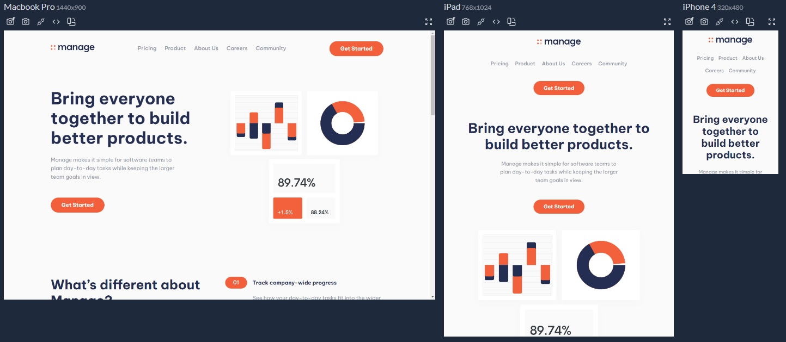

<h1 align="center">
    
    <p align="center">Landing Page com CUBE CSS</p>
</h1>
<p align="center">
    <i align="center">Responsivo de forma simples e organizada🧊</i>
</p>
<p align="center">
    
</p>

## Resumo

<p>Esse projeto é fruto do meu estudo sobre escrever CSS de forma mais organizada e consistente. Veja o índice para mais detalhes.</p>

## 📑Índice

- **[Acesse o Site ⤴](https://landing-page-cube-css.vercel.app/)**
- **[Como instalar](#como-instalar)**
- **[Motivação](#motivação)**
- **[Estrutura do projeto](#estrutura-do-projeto)**
- **[Design Tokens](#design-tokens)**
- **[Texto flúido](#texto-flúido)**
- **[Classes para layout](#classes-para-layout)**
- **[Materiais de estudo](#materiais-de-estudo)**

## 🚀Como Instalar
```
git clone https://github.com/guidiasz/landing-page-cube-css.git
cd landing-page-cube-css
npm install
```
Para gerar o css, uso o comando `npm run postcss:watch`. Para live reload desse projeto eu usei o plugin `live-server` do VScode, mas nada impede de usar o Vite, por exemplo.


## 🧠Motivação

<p>Sempre que eu estilizava um projeto, buscava o famoso <i>pixel perfect</i>. Mas, ainda que eu soubesse exatamente quais regras CSS usar, sentia que estava trabalhando assim:</p>
<br>
<p align="center">
  
  <br>
  <i>Eu alcançava o resultado esperado, mas <strong>definitivamente</strong> não era eficiente</i>
</p>
<br>
<p>A gota d'água foi quando participei de um processo seletivo cujo desafio era construir uma página simples usando Styled Components.</p>
<p>Esteticamente, <strong>fui fiel ao design, mas eu era um piloto de Fusca com uma Ferrari na mão</strong>. Acostumado a só usar css puro, aproveitei muito pouco da capacidade do Styled Components de criar temas. Pra completar, meus componentes não tinham nada de reusáveis.</p>
<p>Concluí que haviam questões em aberto na minha formação:</p>

- Como fazer componentes de fato reusáveis?
- **O que diabos são design systems e como tirar proveitos deles no CSS?**
- **Dá pra escrever CSS sem parecer que estou cavando um buraco com uma colher de sopa?**

<p>Esse humilde repositório tenta responder as duas últimas questões.</p>

## 🏗️ Estrutura do Projeto
```
src
└── css
    ├── blocks
    ├── compositions
    ├── globals
    ├── utilities
    └── global.css
```
Os estilos são separados em globais, <strong>C</strong>omposição, <strong>U</strong>tilidades, <strong>B</strong>locos e <strong>E</strong>xceções (CUBE). 

### PostCSS

`global.css` é o arquivo lido pelo postcss para gerar o public/global.css, com todos os estilos do site.

```css
@import 'tailwindcss/base';

@import 'globals/reset.css';
@import 'globals/fonts.css';

@import 'tailwindcss/components';

@import 'globals/variables.css';

@import-glob 'globals/*.css';
@import-glob 'blocks/*.css';
@import-glob 'compositions/*.css';
@import-glob 'utilities/*.css';

@import 'tailwindcss/utilities';
```

### Tailwind
O Tailwind tem a função de gerar as variáveis CSS a partir de design tokens, além de [criar classes utilitárias sob demanda para o projeto](https://tailwindcss.com/#performance). Dessa forma, posso construir o site inteiramente por composição:
```css
<div class="flow | flow-space-m text-center md:text-left">
  <h1 class="measure-title | font-bold text-step-5 text-primary-400">Bring everyone together to build better products.</h1>
  <p class="measure-compact">Manage makes it simple for software teams to plan day-to-day tasks while keeping the larger team goals in view.</p>
  <a href="#" class="button | flow-space-xl" data-type="accent">Get Started</a>
</div>
```


https://github.com/guidiasz/landing-page-cube-css/assets/38039567/9630eb7a-0ac4-419d-abf6-0453d72f47d9

<p align="center"><i>Fizemos um belo upgrade na fábrica, vai</i></p>

**Esse é o grande salto de qualidade que me permite mais eficiência:**
- Classes para composição que executam muito bem determinada função (como o utilitário `flow`, que permite um espaçamento vertical homogêneo em todo o site);
- Classes utilitárias geradas com Tailwind, ajudam a estilizar elementos simples sem sair do html;
- Design tokens garantem consistência. Para alterar o valor da cor primary-400, por exemplo, basta mudar o valor numa única parte do meu código;
- Quando um elemento demanda muitas regras de css, basta criar um bloco, como [`button`](https://github.com/guidiasz/landing-page-cube-css/blob/main/src/css/blocks/button.css).

## 🎨Design Tokens
Na pasta [design-tokens](https://github.com/guidiasz/landing-page-cube-css/tree/main/src/design-tokens) defino os estilos base do projeto. Tipografia, tamanho de texto, cores e espaçamentos. Esses tokens são lidos pelo [tailwind.config.js](https://github.com/guidiasz/landing-page-cube-css/blob/main/tailwind.config.js) e transformados em variáveis CSS:
```css
:root {
  --font-base: Be Vietnam Pro,Segoe UI,Roboto,Helvetica Neue,Arial,sans-serif;
  --color-neutral-100: #fafafa;
  --color-neutral-200: #ffefeb;
  --color-neutral-400: #9095a7;
  --color-neutral-900: #1d1e25;
  --color-primary-300: #9298aa;
  --color-primary-400: #242d52;
  --color-accent-300: #f99177;
  --color-accent-400: #f25f3a;
  --space-3xs: clamp(0.25rem,0.22rem + 0.14vw,0.3125rem);
  --space-2xs: clamp(0.5rem,0.47rem + 0.14vw,0.5625rem);
  --space-xs: clamp(0.75rem,0.69rem + 0.27vw,0.875rem);
  --space-s: clamp(1rem,0.94rem + 0.27vw,1.125rem);
  /*...*/
}
```
Trabalhar com design tokens é uma excelente forma de deixar o CSS mais consistente.

## 🔤Texto Flúido
Tanto os tamanhos de texto quanto os espaçamentos usam a função `clamp`:
```css
--size-step-0: clamp(1rem,0.94rem + 0.27vw,1.125rem);
--size-step-1: clamp(1.1875rem,1.06rem + 0.54vw,1.4375rem);
--size-step-2: clamp(1.4375rem,1.28rem + 0.68vw,1.75rem);
--size-step-3: clamp(1.75rem,1.53rem + 0.95vw,2.1875rem);
--size-step-4: clamp(2.0625rem,1.71rem + 1.50vw,2.75rem);
--size-step-5: clamp(2.0625rem,1.36rem + 2.99vw,3.4375rem);
```
Isso permite definir valores mínimos e máximos e, assim, o browser calcula o valor adequado para cada tamanho de tela. Dessa forma, não preciso usar media queries:

https://github.com/guidiasz/landing-page-cube-css/assets/38039567/e179e964-b3e3-4c24-b45f-cc838baf457c

## 📐Classes para Layout
Me aproveitei dos [componentes de layout do web.dev](https://web.dev/design-system/css-compositions/) para fazer a composição do projeto. Por extrairem o máximo do Flexbox, os componentes se adaptam ao tamanho da tela sem a necessidade de media queries.

Em todo o projeto, usei media queries apenas nos ajustes finais, resultando em poucas linhas:
```css
  @media (min-width:53.4375em) {
    .md\:text-left {
      text-align: left
    }

    .md\:text-center {
      text-align: center
    }
    .measure-compact,
    .measure-title {
      margin-inline: 0
    }
  }
    @media (min-width:30em) {
    .numberedList__title {
      padding-block: 0;
      padding-right: 0
    }

    .numberedList__title:before {
      display: none
    }

    .numberedList__body {
      grid-column: 2/-1
    }
  }
```

## Curtiu o projeto?

Considere dar uma estrela ⭐.

### Precisa de um dev front-end?

**[Pode conferir meu currículo por aqui](https://bit.ly/3h1Qewn)**.

## 📚Materiais de estudo

- **[Designing Intrinsic Layouts⤴](https://youtu.be/AMPKmh98XLY):** além de explodir minha cabeça, esse vídeo me ajudou a reavaliar a ideia de pixel perfect;
- **[Cube CSS⤴](https://cube.fyi/):** Metodologia que separa os estilos em globais, composição, utilidades, blocos e exceções;
- **[Web Dev Design System⤴](https://web.dev/design-system/):** por ser feito com CUBE CSS, me ajudou a entender melhor a metodologia;
- **[Como usar o tailwind para gerar classes utilitárias⤴](https://andy-bell.co.uk/i-used-tailwind-for-the-u-in-cube-css-and-i-liked-it/)**

## ⚠ Importante
Nenhuma árvore foi ferida na redação desse texto. Considere usar fio dental ao invés de palitos de dente 😅
